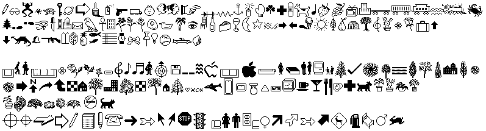
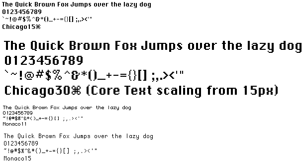
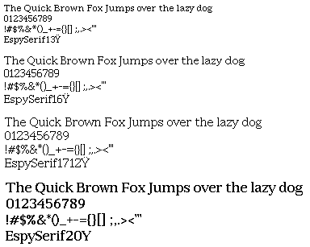
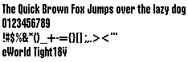
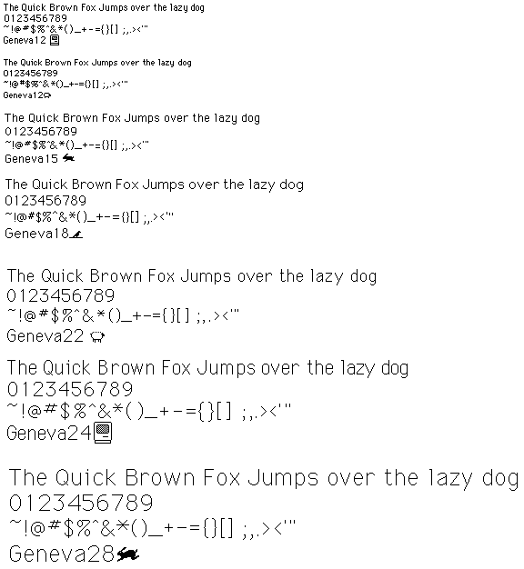
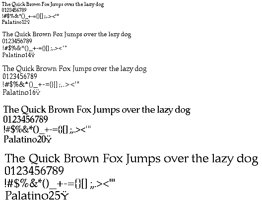

Classic Macintosh Typefaces
-------------------------------
The majority of the work I did on this project is contained in folders Macintosh OS 1-6 and Macintosh OS 7.5_eworld. Scroll down for screenshots of the files that I converted (mostly resource fork fonts between the pre-release Twiggy Mac and System 7.5/eWorld).

The' branding' files have sitting around on my HDD for awhile (awaiting the completion of the main project).

The 'Charcoal_10.11' folder is simply a Charcoal conversion that will turn your system typeface into Charcoal.

'KreativeKorp' is a mirror of [Rebecca G. Bettencourt's excellent work](http://www.kreativekorp.com/software/fonts/index.shtml) creating and converting truetype versions of many of the original typefaces that I have converted (from their original files) for this project.

'Macintosh OS 9' contains all of the Macintosh TrueType typefaces that were never included in releases of OS X. Arguably, chicago still exists through the thai 'Krungthep' typeface, but the spacing and style is not exactly the same.

'Macintosh OS X' contains all of the Macintosh OS X TrueType typefaces that are currently included with OS X, but that the user does not have direct access to.

'Personal' contains some odds and ends of stuff that I've used recently. I might remove this (or expand it with the rest of my personal font files) in the near future.

In terms of the apple TypeFaces that I've converted, this should be an all-encompassing collection. I have provided the FontForge source files (in case anyone has any corrections they would like to make). The converted .dfonts should be true to their original (resource fork) form. There were a few circumstances where I needed to move glyphs out of unicode locations that are now reserved for control characters and other non-user-accessible areas. Other than that, the only other changes I've made (so far) include:
London: [Added]
| Unicode | Name |
| ---- |:-------------:|
| 003C | LESS-THAN-SIGN |
| 003E | GREATER-THAN-SIGN |
| 005E | CIRCUMFLEX-ACCENT |
| 007E | TILDE  |

I am not sure how to copy the fonts off of the Apple Newton (or from the [rom](http://www.unna.org/)/[Einstein emulator](https://github.com/pguyot/Einstein) for that mattter).

Screenshots
-------------------------------

***

***

***

***

***

***

***

***

***

***

***

***

***

***

***

Sources
-------------------------------
http://macgui.com/news/article.php?t=413
https://archive.org/details/Apple_691-0692_eWorld_Apple_Online_Service_1995
https://winworldpc.com/product/mac-os-0-6/
http://macgui.com/downloads/?cat_id=340
http://rolli.ch/MacPlus/welcome.html
http://home.earthlink.net/~gamba2/syslist.html