Classic Macintosh Typefaces
-------------------------------
The majority of the work I did on this project is contained in folders Macintosh OS 1-6 and Macintosh OS 7.5_eworld. Scroll down for screenshots of the files that I converted (mostly resource fork fonts between the pre-release Twiggy Mac and System 7.5/eWorld). This project will provide every typeface that Apple has shipped for use on your Apple Macinosh computer. Most bitmap typefaces were created by Susan Kare (or Bill Atkinson/Andy Hertzfeld) for Apple in 1983/1984 and are still under Apple copyright. I do not claim to own any typeface hosted here. I have simply converted them for use on modern computers.

The 'branding' files have sitting around on my HDD for awhile (awaiting the completion of the main project). Setup Assistant is the only version of Apple Garamond (that I know of) that apple has shipped. Converted from Assistant.rsrc from OS X 10.1.

The 'Charcoal_10.11' folder is simply a Charcoal conversion that will turn your system typeface into Charcoal. This will probably be moved into a separate project.

'KreativeKorp' is a mirror of [Rebecca G. Bettencourt's excellent work](http://www.kreativekorp.com/software/fonts/index.shtml) creating and converting truetype versions of many of the original typefaces that I have converted (from their original files) for this project.

'Macintosh OS 9' contains all of the Macintosh TrueType typefaces that were never included in releases of OS X. Arguably, Chicago still exists through the thai 'Krungthep' typeface, but the spacing and style is not exactly the same.

'Macintosh OS X' contains all of the Macintosh OS X TrueType typefaces that are currently included with OS X, but that the user does not have direct access to.

'Personal' contains some odds and ends of stuff that I've used recently. I might remove this (or expand it with the rest of my personal font files) in the near future.

In terms of the apple TypeFaces that I've converted, this should be an all-encompassing collection. I have provided the FontForge source files (in case anyone has any corrections they would like to make). The converted .dfonts should be true to their original (resource fork) form. There were a few circumstances where I needed to move glyphs out of unicode locations that are now reserved for control characters and other non-user-accessible areas. The (0x20) space character in the Gacha font is an underscore. I have preserved it in its original form for historical brevity.  The only  changes I've made (so far) include:

London: [Added]

| Unicode  | Name |
| ------------- | ------------- |
| 003C  | LESS-THAN-SIGN  |
| 003E  | GREATER-THAN-SIGN |
| 005E | CIRCUMFLEX-ACCENT |
| 007E | TILDE |

I am not sure how to copy the fonts off of the Apple Newton (or from the [rom](http://www.unna.org/)/[Einstein emulator](https://github.com/pguyot/Einstein) for that mattter). I have contacted splorp about this..

Screenshots (Bitmaps)
-------------------------------

***
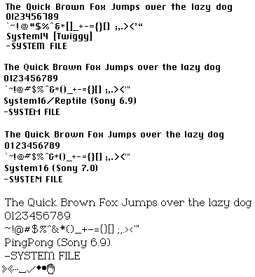
***
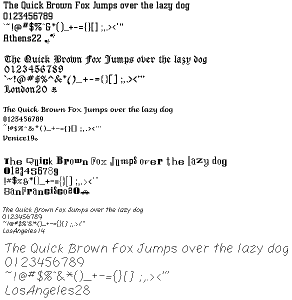
***

***

***
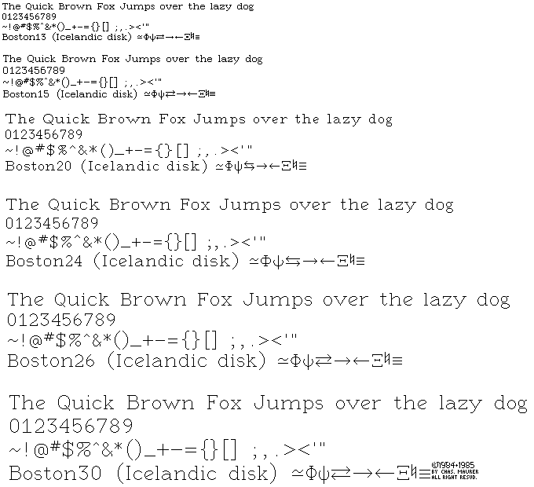
***
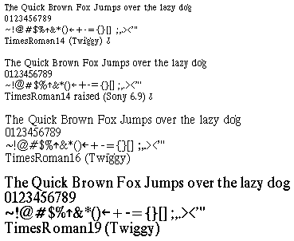
***
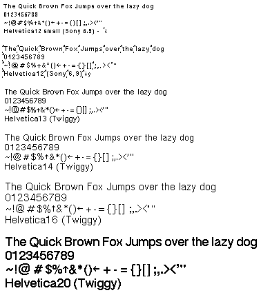
***
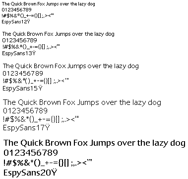
***
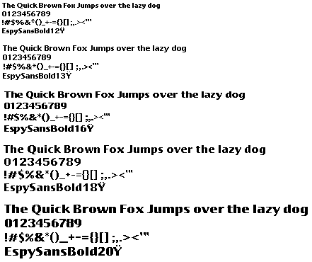
***

***
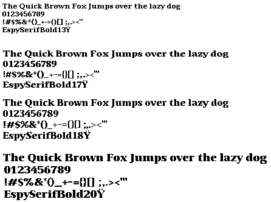
***

***

***
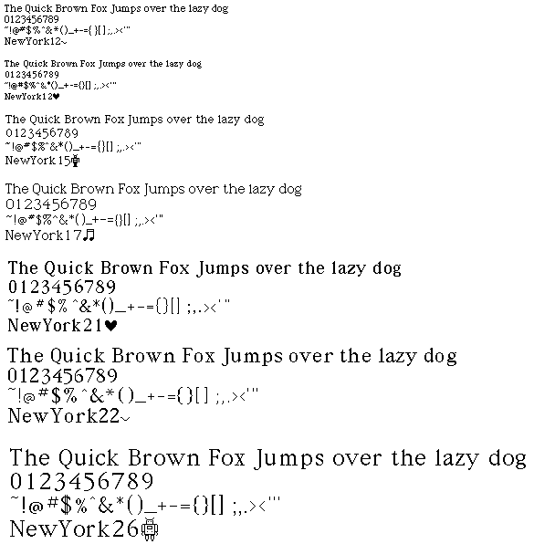
***
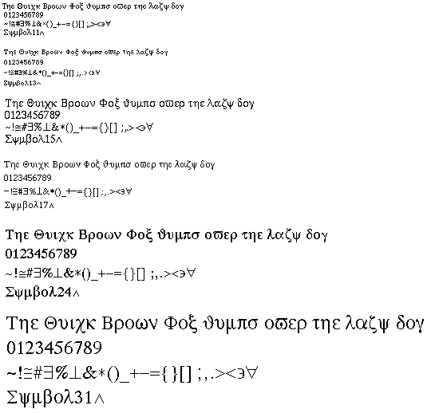
***

***
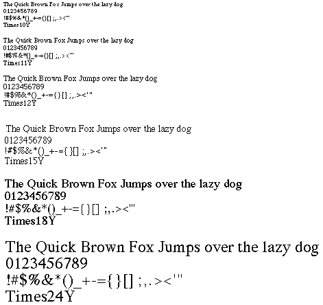
***
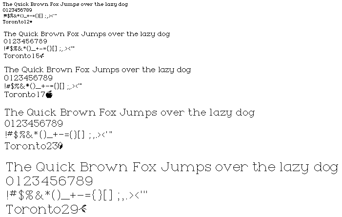
***
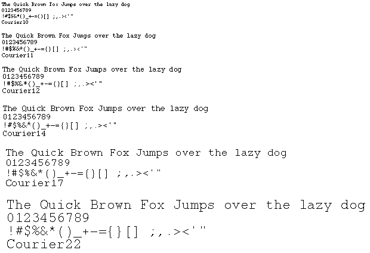
***

Screenshots (TrueType/AntiAliased)
-------------------------------
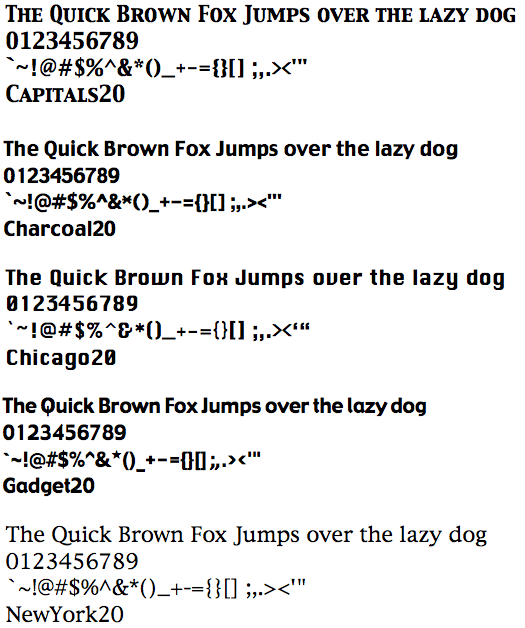
***
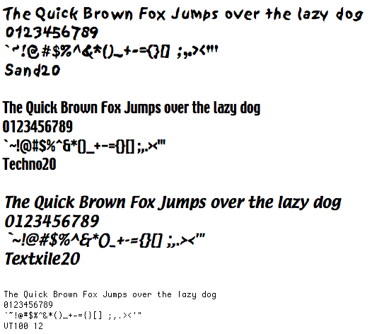
***
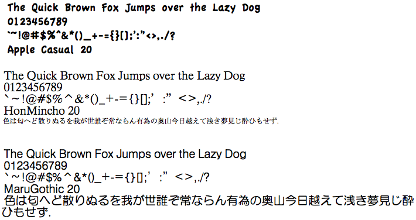
***

Screenshots (Branding)
-------------------------------
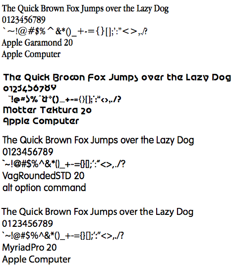
***

Screenshots (Missing)
-------------------------------
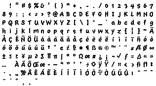
***
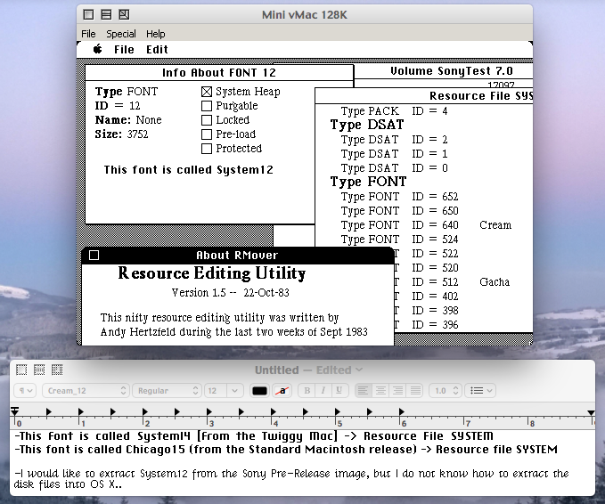
***

Essential Programs
-------------------------------
https://sourceforge.net/projects/rezilla/

https://fontforge.github.io/en-US/

http://www.gryphel.com/c/minivmac/

http://sheepshaver.cebix.net/

http://web.archive.org/web/20030114220848/http://developer.apple.com/fonts/Tools/agreed.html

OS X

Sources
-------------------------------
http://macgui.com/news/article.php?t=413

https://archive.org/details/Apple_691-0692_eWorld_Apple_Online_Service_1995

https://winworldpc.com/product/mac-os-0-6/

http://macgui.com/downloads/?cat_id=340

http://rolli.ch/MacPlus/welcome.html

http://home.earthlink.net/~gamba2/syslist.html

Essential People
-------------------------------
[Susan Kare](http://www.kare.com/), [Andy](http://www.folklore.org/StoryView.py?project=Macintosh&story=Busy_Being_Born,_Part_2.txt) [Hertzfeld](http://www.folklore.org/ProjectView.py?project=Macintosh&index=10&characters=Bruce+Horn&detail=Show+Everything), and [Bill Atkinson](http://www.billatkinson.com/)

[Dog Cow and macintosh1984](http://macgui.com/forums/software-sector/twiggy-mac-prototypes/t.1823_1/) from the Mac GUI forums for work their excellent work on the Twiggy

André G. Isaak from the comp.sys.mac.vintage USENET newsgroup for providing invaluable insight and for providing the Icelandic Apple Developer Connection debug Developer CD which contained Chas. Maurer's 'Boston' typeface

[Helge Horch](http://web.archive.org/web/20060901175940/http://home.netsurf.de/helge.horch/squeak/cream.html), [Bob Flegal](http://squeak-dev.squeakfoundation.narkive.com/Rs0CrNOk/font-history), and [Alan Kay](http://www.freudenbergs.de/bert/publications/Ingalls-2014-Smalltalk78.pdf) for their work on Cream/Smalltalk/etc.

[Taylor](https://github.com/tsul), [mobo](https://github.com/ubuntufag), [kori](https://github.com/kori), [lucy](https://github.com/lucy) for being awesome and, more importantly, great friends.
